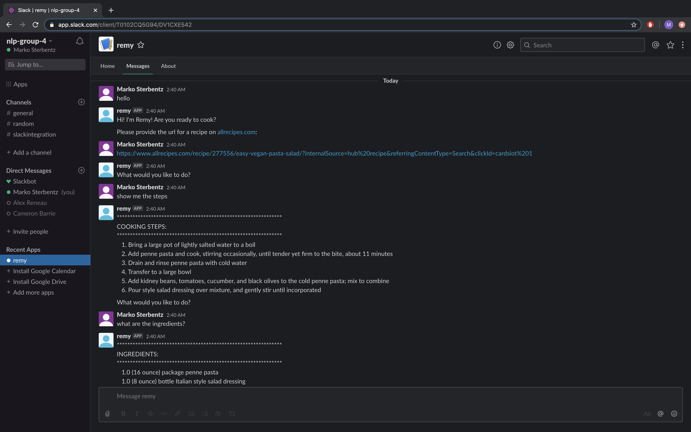

# CS 337 - Remy: A Conversational Recipe Chatbot

This project aims to provide a conversational interface for interacting with the recipe transformer. We utilize the
[Rasa](https://rasa.com/) contextual AI assistant framework to handle user input, determine their intent, and
carry out the proper actions when interacting with our recipe transformer. Additionally, we were able to integrate
this code with [Slack](https://slack.com) in order for the user to be able to interact with this agent in
a Slack workspace.

Team Members (Group 4): Cameron Barrie, Alexander Reneau, Marko Sterbentz

The repository for this project can be found on GitHub: https://github.com/MarkoSterbentz/nlp-recipe-chatbot

## Required Packages
- [Rasa](https://rasa.com/)
  - Installation `pip install rasa`
- [Pandas](https://pandas.pydata.org/) (for data containers)
  - Installation: with `pip install pandas`
- [Spacy](https://spacy.io/) (for general NLP tasks)
  - Installation: `pip install -U spacy`
  - We use the `en_core_web_sm` model, which can be installed with `python -m spacy download en_core_web_sm` after installing Spacy.
- [BeautifulSoup](https://www.crummy.com/software/BeautifulSoup/bs4/doc/) (for web scraping)
  - Installation: `pip install beautifulsoup4`

*Note: A full list of all packages installed can be found in requirements.txt.*

## Installation

*Note: The following installation instructions were tested on MacOS 10.14, and assumes that Anaconda is installed. This
is primarily needed if you are having difficulties installing Rasa or any of the packages within an existing environment.*

### Setting up Rasa
It is recommended that you start by setting up a new virtual environment. We do this through Anaconda with the following command:

`conda create -n <env_name>`

Then, activate this environment so that we can start installing packages there:

`source activate <env_name>`

Install pip in this environment:

`conda install pip`

Switch to a Python version in this environment that is compatible with Tensorflow, and thus Rasa as well:

`conda install python=3.7.5`

Install rasa:

`pip install rasa`

Alternatively, you can also run `pip install -r requirements` (instead of installing Rasa on its own) in the
base project directory to install everything that is required for this project, including Rasa.

## Running the Terminal Version of the Project
This project assumes the use of Python 3.7. From the base project directory, make sure you have the proper virtual
environment activated and run the following command to start the Rasa action server:

`rasa run actions`

Then, in another terminal window, run the following command to ensure there is a model for Rasa to use:

`rasa train`

Once it is done training a model, run the following command in the same terminal to start interacting with Remy:

`rasa shell`

## Connecting the Project to Slack

*Note: We primarily followed
[this tutorial](https://xlog.x-hub.io/build-your-chatbot-with-rasa-and-slack-from-training-to-deploying/)
when connecting our agent to a Slack workspace. Please follow the instructions there to properly configure your
workspace and allow for interaction with Remy.*

Once you've finished configuring the Slack workspace following the instructions at the link above and have ngrok
installed, run the following command:

`rasa run actions`

Then, run `ngrok` in a different terminal to create the tunnel from the local server to Slack:

`ngrok http 5002`

Finally, in yet another terminal window, run the following command to start Remy:

`rasa run --port 5002 --connector slack --credentials slack_credentials.yml --endpoints endpoints.yml`

Lastly, go back to the app settings for Remy (go to `https://api.slack.com/apps/` and click on Remy), click on
Event Subscriptions on the left sidebar, and input the updated ngrok url (it should look something like
`http://97f49c33.ngrok.io/webhooks/slack/webhook`).

With all of this done, reload the Slack workspace. Then, you should be able to click on Remy in the left sidebar,
click on the Messages tab,and start talking to Remy about recipes. An example of this interaction is shown
in the screenshot below:

## How it Works

This project builds off of the [previous course project](https://github.com/MarkoSterbentz/nlp-recipe-transformer) in order to
provide a nice conversational interface for working one's way through a recipe. We utilized Rasa for parsing in input
from the user, as well as extracting intent from their statements. These intents are then mapped to user interaction
stories, which can be found in `stories.md`. Rasa's NLU module evaluates the user's input to predict where the interaction
is going, and uses this prediction to provide the appropriate prompts/output and to carry out the required actions for the user.

The full domain for this conversational agent can be found in `domain.yml`.

Once Remy is running, it can be instructed to perform a variety of actions:

- Retrieve and parse a recipe from AllRecipes.com
- Display the ingredients of the recipe
- Display all of the cookings steps in the recipe
- Display the current cooking step in the recipe
- Go to a specific cooking step in the recipe
- Provide links to video answers for 'how to' questions
- Provide links to web searches for 'what is' questions

## Current Shortcomings
Currently, the parsing and language understanding present in our model is not very good. This is due to
**insufficient NLU training examples**. We plan to expand the training examples within `nlu.md` in order for Remy to
be able to handle a wider variety of user input.
